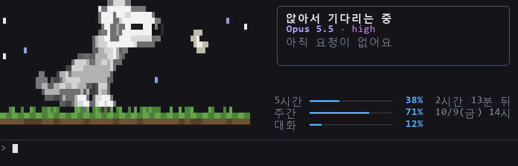
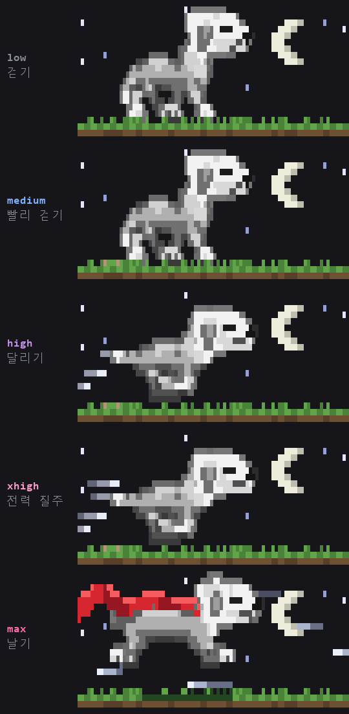
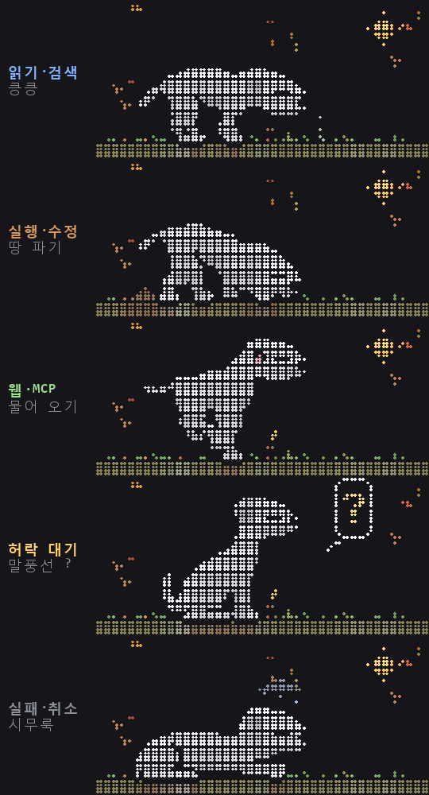
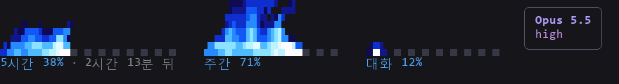

# d3nim-claude-mods

d3nim 팀이 같이 쓰는 Claude Code mods 모음입니다.

## 설치

Claude Code 안에서:

```
/plugin marketplace add d3nims/d3nim-claude-mods
/plugin install usage-meter@d3nim-claude-mods
/plugin install auto-model@d3nim-claude-mods
/reload-plugins
```

터미널에서 해도 됩니다:

```bash
claude plugin marketplace add d3nims/d3nim-claude-mods
claude plugin install usage-meter@d3nim-claude-mods
```

> 공개 저장소라 GitHub 로그인 없이 받을 수 있습니다.

## 업데이트

```
/plugin marketplace update d3nim-claude-mods
/reload-plugins
```

## usage-meter

프롬프트 위에 5시간 · 주간 · 대화 사용량을 보여 주고, 80% · 90% 에서 알려 줍니다.

### `/terry`



### 추론 강도에 따라 달리기가 달라져요

응답하는 동안 테리는 지금 추론 강도(`/effort`)에 맞춰 움직입니다. max 에선 빨간 망토를 휘날리며 날아요. `/terry run max` 처럼 강도를 붙이면 20초 동안 미리 볼 수 있어요.



### Claude 가 하는 일에 따라 움직여요

파일을 읽거나 찾을 땐 킁킁거리고, 명령을 실행하거나 파일을 고칠 땐 땅을 파고(오래 팔수록 뒤에 흙더미가 쌓여요), 웹에서 가져올 땐 막대기를 물어 와요. 허락을 기다리면 말풍선에 `?` 를 띄우고, 요청이 실패하거나 멈추면 고개를 떨구고 시무룩해져요. `/terry sniff` · `dig` · `fetch` · `ask` · `sad` 로 미리 볼 수 있어요.



### 이럴 때도 반응해요

- 테스트가 통과하면 뛰어올라 원반을 물고, 실패하면 고개를 떨구고 꼬리를 말아요.
- 5시간 한도를 다 쓰면 문 앞에서 기다리다가, 풀리는 순간 짖으며 알려 줘요.
- 하루 첫 입력엔 기지개를 켜며 하품하고, 저녁 6시~7시 반엔 가끔 밥을 먹어요.
- 카드의 🐾 를 누르거나 `/terry pet` 하면 좋아해요. 쓰다듬은 횟수는 `/terry stats` 에 남아요.
- 설날·추석엔 복주머니와 송편이, 설치한 지 1년 되는 날엔 케이크가 놓여요.
- `/terry catch` · `droop` · `door` · `stretch` · `eat` 로 미리 볼 수 있어요.

### `/flame1`




| 명령 | 내용 |
| --- | --- |
| `/flame1` | 파란 불꽃 사용량 밴드 + 모델 카드 |
| `/terry` | 입력·응답에 반응하는 베들링턴 테리어, 이번 요청의 시간·토큰 카드, 사용량 표 |
| `/terry run` | 20초 동안 달리는 모습 미리보기 (`sit` `wag` `bark` `happy` `sleep`, `stop` 으로 끝내기) |
| `/terry run max` | 추론 강도별 달리기 미리보기 (`low` `medium` `high` `xhigh` `max`, `middle` · `중간` 도 됨) |
| `/terry dig` | 도구별 동작 미리보기 (`sniff` `dig` `fetch` `ask` `sad`) |
| `/terry catch` | 상황별 동작 미리보기 (`catch` 테스트 통과, `droop` 테스트 실패, `door` 한도 대기, `stretch` 하루 첫 입력, `eat` 저녁) |
| `/terry pet` | 테리 쓰다듬기 (카드의 🐾 를 눌러도 됨) |
| `/terry pane` | 테리를 옆 창에 따로 크게 띄우기 (카드의 🐕 를 눌러도 됨) |
| `/terry stats` | 오늘의 기록: 요청 수, 토큰, 가장 오래 걸린 요청, 테리가 달린 거리, 쓰다듬은 횟수 |
| `/terry braille` · `/terry quad` | 그림 방식 바꾸기 (`/flame1` 도 같음). 테리는 점자(`braille`)가 기본이고 점 하나하나 다듬은 그림이에요. `quad` 는 블록용으로 그렸던 예전(1.0.2) 그림으로 보여요 |
| `/terry help` | 사용법 |

테리는 평소엔 앉아서 숨 쉬며 꼬리를 살랑이다가, 입력하는 동안 혀를 내밀고 꼬리를 흔들고, 엔터를 치면 응답이 끝날 때까지 달리고, 다 끝나면 헥헥거리고, 3분 동안 조용하면 졸아요. 하늘은 실제 시계를 따라 낮엔 해, 밤엔 달과 별이 뜨고, 날짜를 따라 봄엔 꽃잎, 여름밤엔 반딧불, 가을엔 낙엽, 겨울엔 눈이 내려요. 12/31 과 1/1 밤엔 불꽃놀이도 터져요.

### 색이 이상하게 보이면

테리가 청록색이나 보라색으로 보이거나 흙길이 회색이면, 터미널이 트루컬러를 알리지 않아 256색으로 줄여 그려진 것입니다. 셸 설정(`~/.bashrc` 등)에 아래 줄을 넣고 Claude Code 를 다시 켜 주세요.

```bash
export COLORTERM=truecolor
```

### Claude 밖에서 테리 보기

```bash
node docs/preview/terry-view.mjs   # ←→ 동작, e 강도, m 그림 방식, w 너비, t 시각, s 계절, y 명절, space 느리게, q 끝내기
```

## auto-model

프롬프트 캐시를 아끼며 모델을 고릅니다. 캐시는 모델마다 따로이고 마지막 호출 뒤 1시간이 지나면 식어서, 긴 대화에서 함부로 모델을 바꾸면 대화 전체를 다시 저장하느라 오히려 비싸집니다. usage-meter 와 같이 쓰면 테리 카드에 표시됩니다.

- **쉰 뒤 압축 제안:** 1시간 넘게 쉬었고 대화가 15만 토큰 이상이면, 다음 요청이 대화 전체를 다시 쓴다는 걸 알리고 압축을 제안합니다 (`[압축]` `[계속]`). 이때 `[압축]` 은 Sonnet 이 요약합니다(시험에서 Opus 와 같은 품질에 절반 값).
- **작업 중 압축 알림:** 대화가 85% 차면 "지금은 기억이 살아 있어서 싸게 압축돼요" 를 띄웁니다 (`[압축]` `[나중에]`, 나중에는 5%p 더 찰 때까지 안 물음). 이때는 원래 모델이 압축합니다.
- **압축에 사용자 메시지 원문:** 카드의 `[압축]` 으로 하는 압축에는 사용자가 보낸 메시지 원문(긴 붙여넣기는 앞부분만)을 붙여 승인·금지 범위가 흐려지지 않게 합니다. 직접 친 `/compact` 와 자동 압축은 그대로입니다.
- **모델 고르기:** 요청마다 판단하되, 바꾸는 쪽이 확실히 쌀 때만 바꿉니다. 맞장구는 그대로, "ㅇㅋ 진행해" 같은 승인·진행 지시는 무거운 일로 봅니다. 기억을 묻는 짧은 질문의 전환은 지금은 "켰다면"만 기록합니다 (`/auto-model light on` 으로 켜기).
- **서브에이전트:** 모델을 지정하지 않은 검색·탐색 서브에이전트는 Haiku 로 보냅니다.
- **일꾼:** 판단이 필요 없는 일(목적지와 내용이 분명한 쓰기는 Sonnet, 찾기·읽기는 Haiku)은 Opus 를 부르지 않고 일꾼 서브에이전트가 최근 몇 턴만 받아 처리합니다. 일꾼의 답이 대화 끝에 붙어서 Opus 의 캐시는 그대로입니다. 기본은 기록만(`shadow`), `/auto-model worker on` 으로 켜기. `@@ 요청`(Sonnet) · `@@h 요청`(Haiku) 은 손으로 바로 일꾼에게.
- **늘 보이게:** 카드 모델 줄에 `🔄` (바꿔서 씀) `📌` (고정) `✋` (`/model` 로 직접 골라 멈춤). 프롬프트 앞에 `~` 를 붙이면 그 요청은 건너뜁니다.

```
/plugin install auto-model@d3nim-claude-mods
```

| 명령 | 내용 |
| --- | --- |
| `/auto-model` | 지금 상태 |
| `/auto-model off` · `on` | 전부 끄고 켜기 |
| `/auto-model pin opus` · `unpin` | 모델 고정 / 풀기 |
| `/auto-model worker on` · `shadow` · `off` | 일꾼 (기본 shadow: 기록만) |
| `/auto-model log` | 최근 판단 기록 (요청 앞부분, 이유, 대화 크기, 캐시, 사용량, shadow 손익, 놓친 일꾼 후보) |
| `/auto-model preview` | 압축 제안 미리 보기 1분 |
| `/auto-model warn 85` · `off` | 작업 중 압축 알림 기준(%) |

## jev

입력이 "기존 화면처럼 해 달라"(G-1)나 "직전 결과가 틀렸다"(G-3)인지 로컬 판정기로 0.1초에 가려, Claude 가 기준을 바꾸거나 추측으로 재시도하지 않게 짧은 알림을 넣습니다. Ollama(`bge-m3`)가 필요하고, 처음엔 기록만 하는 shadow 모드로 동작합니다.

```
/plugin install jev@d3nim-claude-mods
```

준비·모드·로그는 [`plugins/jev/README.md`](plugins/jev/README.md).

## 도구

- [`tools/paste-hotkey`](tools/paste-hotkey): SSH 로 붙어 쓰는 Claude Code 에 Alt+V 로 캡처 이미지를 붙여넣기 (SSH 를 여는 쪽 Windows PC 에 설치)
